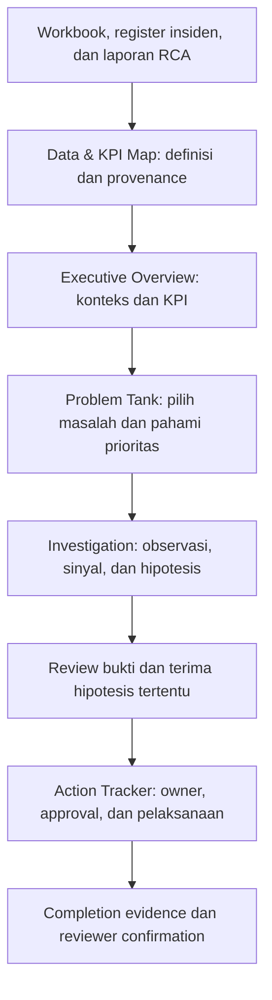

# CALIBER Manufacturing Intelligence Hub

Prototipe web untuk **CALIBER 2026 — Case 2** yang menghubungkan data produksi, kondisi peralatan, register insiden, investigasi akar masalah, dan tindak lanjut dalam satu alur keputusan.

Tujuannya adalah membantu pengguna menjawab: **apa yang perlu diprioritaskan, bukti apa yang mendukungnya, apa yang masih perlu diperiksa, dan siapa yang menindaklanjuti sampai hasilnya diverifikasi?**

Aplikasi berada di [`app/`](app/) dan menggunakan antarmuka berbahasa Inggris. README ini menjelaskan masalah dan alur produk dalam bahasa Indonesia. Panduan teknis lengkap tersedia di [`app/README.md`](app/README.md).

## 1. Masalah yang ditangani

Baseline menyediakan workbook produksi, pengukuran kondisi mingguan, register insiden, dan laporan RCA (_Root Cause Analysis_) secara terpisah. Sumber tersebut memiliki periode, unit, dan beberapa informasi yang tidak selalu sesuai satu sama lain. Angka pada dashboard saja belum cukup untuk menentukan tindakan yang dapat dipertanggungjawabkan.

| Tantangan                                                                             | Respons prototipe                                                                                                                                                    |
| ------------------------------------------------------------------------------------- | -------------------------------------------------------------------------------------------------------------------------------------------------------------------- |
| Data dan definisi KPI tersebar                                                        | **Data & KPI Map** menghubungkan sumber, unit, periode, formula, dan usulan penanggung jawab data.                                                                   |
| Sulit menghubungkan gambaran eksekutif dengan masalah peralatan                       | **Executive Overview** memisahkan ringkasan register dari tren aset, lalu menyediakan akses ke masalah dan sumbernya.                                                |
| Banyak insiden dan pembacaan kondisi perlu ditinjau                                   | **Problem Tank** menyediakan pencarian register serta episode kondisi dengan severity, alasan prioritas, dan sampel pendukung.                                       |
| Dugaan akar masalah bisa tercampur dengan hasil inspeksi yang baru diketahui kemudian | **Investigation** memisahkan historical findings, engineering hypotheses, counter-evidence, dan missing checks; mode prospective membatasi bukti berdasarkan cutoff. |
| Rekomendasi belum menjamin tindak lanjut selesai                                      | **Action Tracker** menghubungkan draft dengan hipotesis, owner, due date, approval, completion evidence, dan reviewer confirmation.                                  |
| Case meminta ilustrasi energi/emisi, tetapi baseline tidak menyediakannya             | Kartu baseline menyatakan data tidak tersedia; mode utilities sintetis yang terpisah memperlihatkan asumsi dan contoh forecast.                                      |

Prototipe menunjukkan cara menyusun proses keputusan dan review. Repository ini belum membuktikan penurunan downtime, penghematan, atau efektivitas operasional di fasilitas nyata.

## 2. Cakupan data dan pengguna

Repository memuat **22 berkas sumber**: 16 baseline data files, satu explanation deck, satu supplemental meeting summary, dua PDF resmi, dan dua reference snapshots. Baseline terdiri dari lima workbook produksi, lima workbook kondisi peralatan, lima RCA deck, serta satu register dengan **380 insiden**.

Lima skenario aset dapat dinavigasi:

| Equipment tag | Peralatan                        | Label plant dari sumber | Peran dalam demo                                                          |
| ------------- | -------------------------------- | ----------------------- | ------------------------------------------------------------------------- |
| PU-2101B      | Feed Charge Pump                 | ARP                     | Review kondisi seal/flush dan laporan RCA.                                |
| KO-3201       | Cracked Gas Compressor           | ZCU                     | Alur utama: observasi → investigasi → reviewed action → verified closure. |
| PM-4405B      | Cooling Water Pump, Motor Driven | NUP                     | Review kondisi pompa dan konflik informasi standby supply.                |
| HE-3301       | Feed/Effluent Heat Exchanger     | ZCU                     | Membandingkan status aset dengan dampak pada plant.                       |
| BL-5702       | Product Blower                   | OPP                     | Review tren kondisi dan laporan RCA blower.                               |

Label plant merupakan label skenario pada sumber, bukan verifikasi fasilitas perusahaan tertentu. **380 insiden bukan 380 kegagalan dari lima aset demo**; register memiliki cakupan yang lebih luas. Periode pengamatan setiap aset juga berbeda.

Pengguna utama adalah plant manager dan reliability engineer. Pilihan **Simulated role** mencakup Plant manager, Reliability engineer, Maintenance reviewer, dan Engineering reviewer. Pilihan ini mendemonstrasikan review workflow, bukan autentikasi atau otorisasi perusahaan.

## 3. Alur prototipe untuk menangani masalah



Diagram menunjukkan hubungan informasi; pengguna tetap dapat berpindah langsung di antara lima halaman melalui sidebar.

### Langkah 1 — Pahami konteks melalui Executive Overview

Pilih **Asset scenario**. Periksa incident count, downtime, actual loss, dan potential loss pada scope register yang aktif. Filter plant/tanggal memengaruhi ringkasan register dan Status Composition.

Tren hourly dan weekly milik aset ditampilkan sebagai sumber yang terpisah, lengkap dengan unit dan window. Gunakan **Definition & source**, **View readings**, atau **View source** untuk memeriksa dasar angka sebelum mengambil keputusan.

### Langkah 2 — Periksa definisi dan kualitas data

Di **Data & KPI Map**, telusuri Source Library, buka source content, atau download original. KPI Dictionary menyediakan definisi, formula/basis, sumber, dan editor usulan data steward.

Evidence Discrepancies memperlihatkan perbedaan yang memerlukan review. Governance & Integration Roadmap menjelaskan usulan stewardship, pilot validation, dan integrasi berikutnya; roadmap tersebut bukan daftar milestone yang sudah selesai.

### Langkah 3 — Pilih masalah di Problem Tank

Halaman ini membedakan dua jenis informasi:

- **Historical register:** seluruh 380 insiden dapat dicari dan difilter. Statusnya merupakan snapshot sumber.
- **Derived condition episodes:** pembacaan kondisi dikelompokkan dengan sampel pendukung dan alasan prioritas. Acknowledge, group, dan reopen adalah aktivitas workspace lokal.

Prioritas memakai aturan deterministik yang dijelaskan, seperti TRIP sebelum ALARM, criticality, serta source risk score jika tersedia dan eligible. Aturan ini membantu review; belum merupakan model risiko yang tervalidasi di operasi nyata.

Saat membuka Investigation dari episode, asset, analysis mode, dan cutoff tetap dibawa bersama konteks masalah.

### Langkah 4 — Investigasi berdasarkan bukti yang eligible

Di **Investigation**, pengguna mengikuti urutan **observations → signals → hypotheses → review → linked action**:

1. Periksa tren hourly/weekly secara terpisah. Selector, inspection slider, tabel readings, dan source drawer membantu meninjau titik pengamatan tertentu.
2. Tinjau sinyal kondisi dan discrepancies. Perbedaan unit atau sumber tidak otomatis diselesaikan oleh aplikasi.
3. Dalam historical review, telusuri similar incidents dan RCA archive. Similarity memakai kecocokan atribut/teks; ranking bukan probabilitas penyebab.
4. Pilih **Evidence replay - no live AI call** untuk menyusun hasil deterministik dari bukti eligible tanpa provider eksternal. Live composition merupakan pilihan lokal terpisah yang memiliki guard.
5. Untuk tiap hipotesis, periksa supporting evidence, counter-evidence, missing checks, dan alasan strength yang bersifat kualitatif.
6. Terima atau tolak hipotesis tertentu. Draft action terhubung dengan hipotesis yang diterima, termasuk jika pengguna memilih hipotesis selain yang pertama.

Jika tidak ada observasi atau bukti anomali tidak cukup, aplikasi menampilkan keadaan tersebut. **Insufficient anomaly evidence** tidak menghasilkan diagnosis atau maintenance draft yang dipaksakan.

### Langkah 5 — Tindak lanjuti sampai verified closure

Action hasil review masuk ke **Action Tracker** sebagai draft lokal dengan kaitan case, hipotesis, evidence, dan priority reason.

```text
Draft → Approved → In Progress → Pending Verification → Closed
```

- Sebelum approval, isi owner dan due date; evidence serta hubungan hipotesis tetap diperlukan.
- Saat pekerjaan dianggap selesai dalam demo, masukkan **completion evidence**, lalu submit for verification.
- Closure memerlukan **Engineering reviewer** serta konfirmasi review evidence.
- Rejection/cancellation memerlukan alasan. Perubahan status dicatat dalam history.
- Imported historical report actions tetap read-only; penutupan action demo tidak mengubah insiden atau CAPA historis.

Metrik dan drawer **Definition & local evidence** memakai definisi scope yang sama. Dalam historical review, metrik mencakup seluruh workspace; filter list tidak mengubah total kartu. Dalam prospective, hanya action dengan asset, mode, dan cutoff yang cocok yang eligible. Action historis serta episode acknowledgements tanpa provenance scope tidak masuk ke drawer prospective.

Actions, proposed owners, review decisions, episode states, dan history disimpan di **localStorage browser**, bukan database bersama. **Reset workspace** memerlukan konfirmasi dan membersihkan workspace prototipe; tidak menghapus originals atau konfigurasi server.

## 4. Historical review dan prospective/pre-event

| Mode                      | Makna dan batas bukti                                                                                                                                                                                                                                     |
| ------------------------- | --------------------------------------------------------------------------------------------------------------------------------------------------------------------------------------------------------------------------------------------------------- |
| **Historical review**     | Review retrospektif yang dapat memakai register dan laporan RCA selesai. Jika observation cutoff dipasang, cutoff membatasi pengamatan; laporan tetap konteks retrospektif, bukan bukti yang diketahui pada cutoff tersebut.                              |
| **Prospective/pre-event** | Review memakai observasi eligible sebelum event sesuai cutoff. Current-event RCA, laporan lain dengan availability yang tidak diketahui, future readings, remarks, outcome/risk/loss summaries, dan register retrieval dikeluarkan dari konteks analisis. |

Timestamp mengikuti waktu lokal sumber; **timezone tidak diketahui**. Pembacaan weekly yang hanya memiliki tanggal dianggap eligible pada akhir hari, sebagai konvensi replay konservatif. Cutoff midnight dan end-of-day karena itu dapat menghasilkan dataset yang berbeda. Mode prospective belum membuktikan kemampuan prediksi kegagalan.

## 5. Contoh walkthrough KO-3201

1. Buka Executive Overview dengan KO-3201. Jelaskan perbedaan scope register dan window aset, lalu buka sumber salah satu KPI.
2. Buka prioritized issues di Problem Tank dan pilih episode KO. Periksa severity, priority reason, dan supporting samples.
3. Buka Investigation dalam prospective dengan cutoff `2026-04-22 00:00:00`, lalu bandingkan dengan `2026-04-22 23:59:59`. Pembacaan weekly 22 April baru eligible pada end-of-day.
4. Periksa hourly metadata **MM/S** dan weekly vibration **micron**. Perbandingan langsung diblokir; keduanya tidak dikonversi atau diberi threshold bersama.
5. Jalankan evidence replay, baca counter-evidence/missing checks, terima satu hipotesis, lalu buat draft miliknya.
6. Selesaikan action loop: owner/due date → approve → start → completion evidence → submit for verification → Engineering reviewer → confirm verified closure. Gunakan input simulasi yang jelas untuk demo.
7. Beralih ke historical review untuk memeriksa laporan. Temuan cooler leak adalah hasil RCA historis setelah inspeksi; tidak boleh diceritakan sebagai keberhasilan prediksi pre-event.
8. Sebagai pembanding, buka HE-3301: **13 sampel OFF** dengan plant rate nonzero dan **12 h downtime** pada RCA adalah informasi berbeda. Asset OFF tidak otomatis berarti plant shutdown.

Outline narasi/video tiga menit dalam bahasa Inggris tersedia di [`app/WALKTHROUGH.md`](app/WALKTHROUGH.md).

## 6. Integritas data dan batas klaim

- Angka dan bukti memiliki source locator seperti file, sheet, cell/range, atau slide. Status **source-stated**, **computed**, **proposed**, dan **synthetic** harus dibedakan.
- Register memakai stable row IDs dan qualified links. **226 AR literal `n/a`** dan dua identifier AR yang dipakai ulang tidak boleh menjadi alasan untuk menghapus atau menggabungkan insiden.
- Kolom finansial memakai **k US$**. **Total Loss = Act. Loss + Pot. Loss** adalah exposure; total ini bukan realized loss keseluruhan, recoverable savings, atau ROI solusi.
- Window produksi antar-aset tidak disatukan sebagai snapshot fleet serentak. Throughput PM mempertahankan unit equivalent throughput.
- Konflik KO MM/S vs micron, 1530 vs 1800 ppm, dan historical alarm 60 vs 45 tetap terlihat. Alarm counts adalah pembacaan weekly yang diklasifikasikan workbook, bukan jumlah ignored alerts.
- Konflik HE asset/plant dan PM standby supply tetap dipertahankan. Availability, PM compliance, serta generic design-life metadata memiliki keterbatasan sumber.
- Baseline tidak mendukung klaim OEE, RUL, failure probability, savings, atau persentase improvement yang tervalidasi.

Aturan lengkap: [`docs/DATA_RULES.md`](docs/DATA_RULES.md) dan [`app/SOURCE_AND_ASSUMPTION_NOTES.md`](app/SOURCE_AND_ASSUMPTION_NOTES.md).

### Utilities: ilustrasi yang terpisah

Baseline tidak memiliki meter energi/emisi; kartu default menyatakan data unavailable. **Open illustrative utilities** mengaktifkan dataset sintetis deterministik dengan editable assumptions dan label yang eksplisit.

Generator menghasilkan 72 sampel hourly. Forecast 24 jam berikutnya memakai rata-rata 24 sampel terakhir sebagai nilai persistence. Emissions memakai energy × illustrative factor yang dapat diedit; intensity memerlukan output yang valid dan unavailable bila output nol. Angka ilustrasi tidak masuk ke register, baseline alerts, atau evidence kasus AI. Tidak ada klaim factor perusahaan, legal limit, atau akurasi forecast nyata.

## 7. Menjalankan aplikasi lokal

Gunakan Node.js 22 dan npm; panduan teknis mencatat pengujian dengan Node 22.23.2/npm 10.9.8. Jalankan dari root repository:

```bash
cd app
npm ci
npm run dev
```

Buka **http://127.0.0.1:3100**. Database, API key, dan live provider tidak diperlukan untuk evidence replay. `predev` memeriksa sumber dan menyiapkan salinan runtime; folder canonical `sources/`, `processed/`, dan `PACKAGE_MANIFEST.json` harus tetap tersedia.

Jika port 3100 sedang dipakai, periksa pemiliknya atau gunakan port lain tanpa menghentikan proses yang tidak dikenal:

```bash
lsof -nP -iTCP:3100 -sTCP:LISTEN
# Dari app/:
npm run prepare:runtime
npx next dev --hostname 127.0.0.1 --port 3101
```

Untuk production lokal, dari `app/`:

```bash
npm run build
npx next start --hostname 127.0.0.1 --port 3102
```

### AI opsional

**Evidence replay** selalu tersedia dan tidak melakukan live AI call. Live default tetap disabled. Mode public di Vercel dapat diaktifkan secara eksplisit setelah domain HTTPS dan shared Redis guards dikonfigurasi. Live lokal memerlukan konfigurasi server-only di **`app/.env.local`**, exact model ID, API key, demo passcode/session secret, dan quota guards; pemilihan Simulated role tidak membuka akses provider.

Jangan menimpa `.env.local` yang sudah ada, memakai suffix `.txt`, atau menaruh secrets dalam README, Git, dan `NEXT_PUBLIC_*`. Lihat [Optional local live AI](app/README.md#optional-local-live-ai) dan [Protected live AI on Vercel](app/README.md#protected-live-ai-on-vercel) untuk konfigurasi lengkap. Dukungan endpoint/model dan hasil real provider tidak dianggap terbukti hanya karena konfigurasi tersedia; error atau hasil invalid ditampilkan sebagai fallback replay yang jelas.

## 8. Struktur repository

```text
app/
  src/components/     Lima halaman, shell, charts, drawers, dan shared UI
  src/lib/            Scope/time, signals, retrieval, evidence, actions, utilities
  src/app/api/        Server routes untuk case, episodes, source, analysis, status, session
  data/               Normalized JSON untuk aplikasi
  scripts/            Preparation, normalization, dan artifact verification
  tests/              Domain/API dan browser regression tests
  screenshots/        Capture hasil verifikasi yang terdokumentasi
  verification/       Logs dan hasil pengujian
docs/                 Spesifikasi, data rules/contracts, acceptance, roadmap
processed/            Ekstraksi sumber, inventory, metrics, dan provenance
sources/              Originals baseline, official PDFs, notes, reference snapshots
scripts/              Verifikasi handoff dan audit sumber
validation/           Requirements traceability dan delivery checks
PACKAGE_MANIFEST.json Manifest paket handoff asli
```

Stack aplikasi: **Next.js 16.3.8, React 19.3.0, TypeScript**, server routes, local JSON, dan localStorage untuk workspace. Implementasi tidak memerlukan FastAPI, Azure, vector database, atau separate agent processes. Microsoft reference snapshot pada commit `26b906d3e2e3f073ced52bd15ee2ae6c150625fe` menjadi referensi workflow; tire-factory data dan Azure dependencies tidak diimpor sebagai baseline.

## 9. Verifikasi dan dokumentasi lanjutan

Pemeriksaan aplikasi dari `app/`:

```bash
npm run typecheck
npm run lint
npm test
npm run build
npm run format:check
npm run test:deploy
```

Untuk browser regression terhadap **production build**, jalankan server production pada 3102 seperti di atas. Di terminal lain, dari `app/`:

```bash
npx playwright install chromium
CALIBER_TEST_BASE_URL=http://127.0.0.1:3102 npm run test:browser
```

`test:deploy` memeriksa temporary artifact-only runtime lokal; perintah itu tidak melakukan deployment. Test provider memakai fake/mock transport. Hasil aktual dan bagian yang belum diuji dicatat di [`app/IMPLEMENTATION_STATUS.md`](app/IMPLEMENTATION_STATUS.md), bukan diasumsikan dari daftar perintah ini.

Untuk integritas handoff, dari root:

```bash
python scripts/verify_package.py
```

Dokumentasi verifikasi mencatat originals lolos, tetapi full handoff manifest memiliki discrepancy ukuran/hash `CODEX_PROMPT.md` yang sudah ada. Jangan menulis ulang manifest untuk menyembunyikannya. Periksa originals sebelum menjalankan extractor/normalizer; sumber asli harus dipertahankan.

| Dokumen                                                               | Isi                                                                                                               |
| --------------------------------------------------------------------- | ----------------------------------------------------------------------------------------------------------------- |
| [App README](app/README.md)                                           | Setup, ports, environment, AI guards, runtime preparation, dan commands teknis.                                   |
| [Solution specification](docs/SOLUTION_SPEC.md)                       | Tujuan dan pemetaan kebutuhan Case 2; beberapa bagian merupakan proposal awal, bukan status implementasi terbaru. |
| [Data contracts](docs/DATA_CONTRACTS.md)                              | Struktur data dan kontrak integrasi.                                                                              |
| [Acceptance](docs/ACCEPTANCE.md)                                      | Kriteria penerimaan prototipe.                                                                                    |
| [UX contract](app/UX-CONTRACT.md)                                     | Perilaku navigasi, scope, controls, dan action workflow.                                                          |
| [Design](app/DESIGN.md)                                               | Arah light SaaS, tokens, dan shared components.                                                                   |
| [UI refinement report](app/UI_REFINEMENT_REPORT.md)                   | Revisi layout, screenshot, hasil verifikasi, serta batas audit.                                                   |
| [Repair report](app/REPAIR_REPORT.md)                                 | Riwayat perbaikan dan regression verification.                                                                    |
| [Requirements traceability](validation/REQUIREMENTS_TRACEABILITY.csv) | Hubungan kebutuhan, implementasi, dan bukti.                                                                      |

[`README_START_HERE.md`](README_START_HERE.md) merupakan petunjuk paket handoff awal ketika aplikasi belum dibangun. Gunakan README ini dan dokumentasi `app/` untuk memahami repository yang sudah berisi prototipe.

## 10. Tahap berikutnya

Penggunaan operasional memerlukan pilot bersama domain engineers dan KPI owners, validasi kebijakan alarm, sumber historian/CMMS/utility meter yang nyata, serta identity, authorization, audit, retention, dan IT/OT boundaries yang sesuai. Integrasi tersebut adalah pekerjaan lanjutan, bukan kemampuan yang sudah dibuktikan oleh demo lokal.

Tim menangani slides/video dan submission kompetisi. Prototipe ini membantu mendemonstrasikan hubungan **masalah → bukti → keputusan → tindakan → verifikasi**, dengan batas data dan asumsi tetap terlihat.
